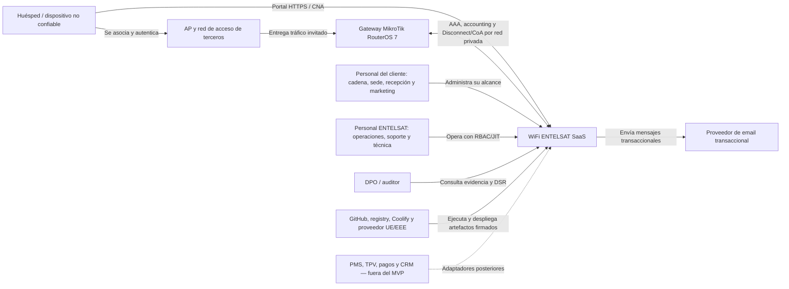
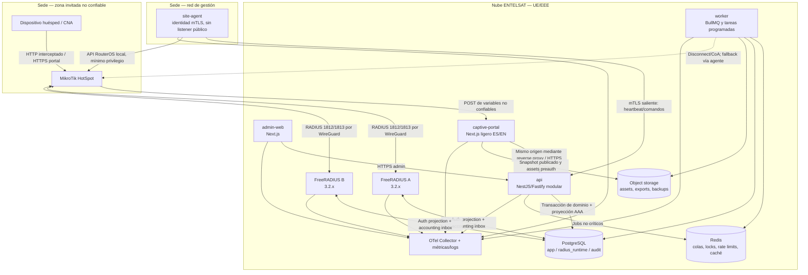
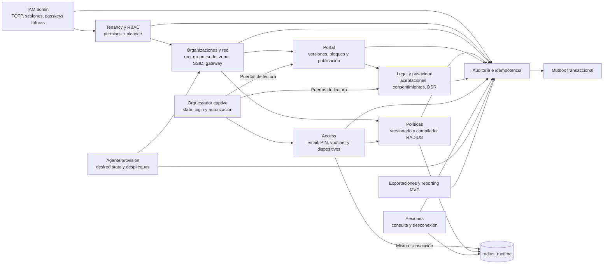
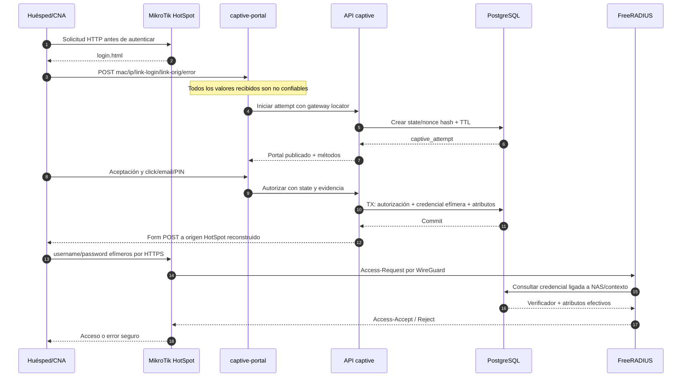
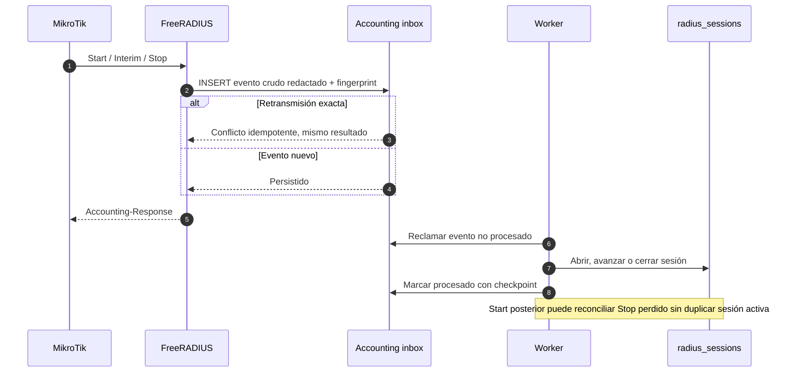
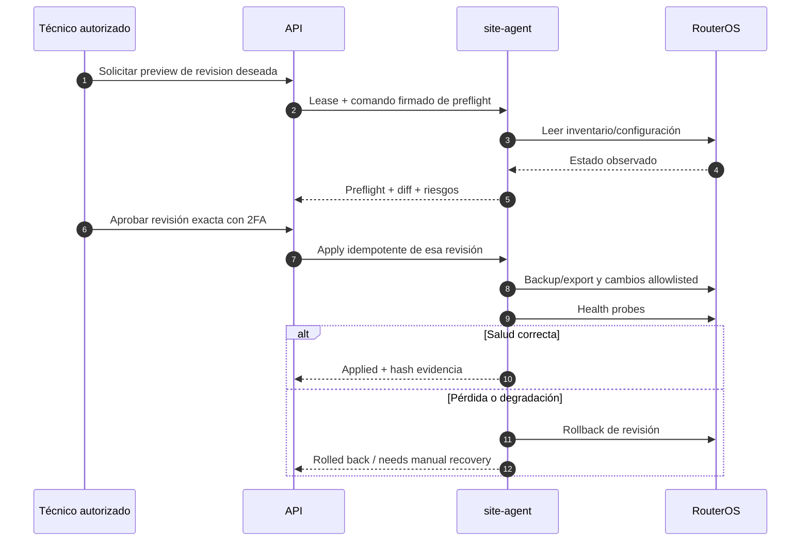

# WiFi ENTELSAT — arquitectura C4 inicial

**Estado:** propuesto  
**Fecha:** 2026-08-15  
**Alcance:** MVP; los diagramas describen responsabilidades y límites, no despliegues ya validados

## Principios de lectura

- **Plano de control:** panel, configuración, publicación, auditoría, privacidad y reporting.
- **Plano de acceso:** portal captive, emisión de autorización, FreeRADIUS, accounting y sesión en RouterOS.
- La ruta crítica del WiFi no depende de campañas, editor, email comercial, exportaciones ni panel.
- Las flechas que cruzan la LAN de invitados, la LAN de gestión, WireGuard o proveedores externos cruzan límites de confianza.

## C4 nivel 1 — contexto del sistema

### Actores y objetivos

| Actor/sistema | Objetivo | Confianza inicial |
|---|---|---|
| Huésped | Obtener acceso bajo una política y ejercer derechos | No confiable; MAC/IP/formulario son claims |
| MikroTik | Interceptar, consultar AAA, aplicar límites y contabilizar | Confiable solo tras identidad NAS, túnel y secreto/certificado |
| Cliente | Configurar exclusivamente sus organizaciones/sedes | Confiable dentro de permiso y alcance, no por rol nominal |
| ENTELSAT | Operar plataforma y red | Sin acceso permanente a PII/secretos; JIT cuando proceda |
| DPO/auditor | Revisar legalidad y evidencia | Solo lectura; exportación ligada a expediente |
| Proveedores | Entregar infraestructura o mensajes | Externos; contrato, minimización y egress controlado |

## C4 nivel 2 — contenedores

### Responsabilidades y datos permitidos

| Contenedor | Responsabilidad | Puede persistir | No debe conocer |
|---|---|---|---|
| `admin-web` | UX administrativa | Solo estado cliente efímero | Secretos, credenciales captive, conexión DB |
| `captive-portal` | Render publicado y flujo captive | Cookie/state mínimo, sin perfil completo | IAM admin, facturación, campañas no publicadas |
| `api` | Única puerta de escritura de dominio | Datos transaccionales y auditoría | Shared secrets en logs o respuestas |
| `worker` | Outbox, accounting, retención, exports, email | Checkpoints/jobs idempotentes | Acceso transversal sin `tenant_id` |
| FreeRADIUS | AAA, post-auth, accounting, Disconnect/CoA | Proyección AAA e inbox mínimo | PII, portal, RBAC admin |
| `site-agent` | Inventario y cambios declarativos | Estado/cola local cifrada mínima | Credenciales de otros gateways o tenants |
| Redis | Efímero, colas y rate limits | IDs opacos con tenant | Fuente de verdad o PII clara |
| Object storage | Assets, exports y backups | Objetos cifrados y prefijados por tenant | ACL pública accidental o secretos sin cifrar |

## C4 nivel 3 — componentes del monolito modular

### Reglas de dependencia

1. Un módulo es propietario de sus tablas y repositorios.
2. Otro módulo consume un puerto de aplicación o un evento; no importa el repositorio ajeno.
3. La creación de `access_authorization` y su proyección RADIUS ocurre en la misma transacción.
4. Reporting usa sesiones normalizadas, no paquetes RADIUS crudos.
5. El outbox publica efectos posteriores al commit; nunca habilita un login que necesita consistencia inmediata.
6. `Captive` no puede depender de Redis, BullMQ, campañas, email comercial o exports para completar click/email/PIN.

## Secuencia crítica 1 — login captive externo

Controles imprescindibles:

- el gateway locator es público y no autentica;
- el host/puerto de retorno se reconstruye desde inventario, no desde `link-login`;
- `link-orig` no puede actuar como open redirect;
- la credencial expira, tiene usos limitados y se vincula a gateway/NAS y contexto esperado;
- ninguna credencial aparece en URL, analytics, logs o referer;
- el RADIUS real, no el POST inicial, confirma NAS y `Calling-Station-Id`.

## Secuencia crítica 2 — accounting y reconciliación

La huella incluye tenant/gateway, NAS, `Acct-Session-Id`, status, tiempo de evento/sesión y contadores de 64 bits. No se deduplica únicamente por `event_type`.

## Secuencia crítica 3 — cambio declarativo de gateway

## Comportamiento ante fallos

| Fallo | Sesiones existentes | Nuevos logins | Operación admin | Decisión |
|---|---|---|---|---|
| `admin-web` | Continúan | Continúan | Panel no disponible | Aislado del acceso |
| Redis/BullMQ | Continúan | Click/email/PIN básico debe continuar | Jobs/exports se pausan | Redis no está en hot path |
| API captive | Continúan | Fallan cerrados | Parcialmente degradada | No fail-open |
| PostgreSQL | Continúan mientras RouterOS las mantenga | Fallan cerrados | No disponible | Requiere HA/RTO |
| Un FreeRADIUS | Continúan | Conmutan al segundo | Visible como alerta | Dos nodos |
| Ambos FreeRADIUS | Continúan según política aplicada | Fallan cerrados | Alerta crítica | Emergencia explícita opcional |
| `site-agent` | AAA directo continúa | Continúan si RADIUS/túnel funciona | Sin deploy/fallback | Agente no es proxy AAA |
| WAN sede | No se promete Internet | No se promete acceso | Heartbeat perdido | Reconciliar al volver |

## Límites de confianza y STRIDE inicial

| Límite/activo | Riesgo STRIDE prioritario | Control de diseño | Evidencia requerida |
|---|---|---|---|
| POST `login.html` | Spoofing/tampering/open redirect | Entrada no confiable, origen reconstruido, state/nonce, TTL, binding NAS/MAC | L02–L04 |
| Voucher/PIN | Spoofing/replay/DoS | Alta entropía, HMAC, comparación constante, rate limit y redención atómica | Tests de enumeración y concurrencia |
| RADIUS por red | Spoofing/disclosure/tampering | WireGuard, secreto por gateway, Message-Authenticator, allowlist NAS | L08–L09 |
| Disconnect/CoA | Elevation/DoS | Puerto privado, atributos de selección exactos, ACK/NAK, permisos separados | L16–L17 |
| Accounting | Tampering/repudiation | Inbox append-only, fingerprint, Class, tiempos separados, reconciliación | L13–L15 |
| RLS/tenant | Disclosure/elevation | FK compuesta, RLS forzada, rol sin BYPASSRLS, tests negativos | Suite multi-tenant |
| Agente/RouterOS | Elevation/tampering | mTLS, comandos firmados/idempotentes, usuario mínimo, preflight/rollback | Prueba de replay y pérdida |
| PII/exports | Disclosure/repudiation | HMAC por identity space, cifrado, JIT, doble aprobación, TTL | DSR y export auditado |
| Assets/HTML | XSS/SSRF/disclosure | Tipos/tamaño, sanitización, CSP, origen aislado, egress allowlist | DAST/CSP/upload tests |
| Logs/telemetría | Disclosure | Redacción, cardinalidad controlada, prohibición de secretos/PII | Escaneo automatizado |

## Decisiones aún no representables como “hecho”

- HTTPS/PAP frente a CHAP: `BLOCKED_BY_LAB_VALIDATION`.
- Cuotas totales/Gigawords, dirección contable y selector CoA: `BLOCKED_BY_LAB_VALIDATION`.
- Modelos y versión RouterOS de producción: `BLOCKED_BY_LAB_VALIDATION`.
- Topología HA, RTO/RPO y emergencia: pendiente de pregunta 6.
- Responsable/encargado, retención, identity spaces y DPIA: `BLOCKED_BY_LEGAL_REVIEW`.

## Fuentes primarias

- [MikroTik HotSpot](https://manual.mikrotik.com/docs/authentication-authorization-accounting/hotspot-captive-portal/)
- [MikroTik HotSpot customisation](https://manual.mikrotik.com/docs/authentication-authorization-accounting/hotspot-captive-portal/hotspot-customisation/)
- [MikroTik RADIUS](https://manual.mikrotik.com/docs/authentication-authorization-accounting/radius/)
- [PostgreSQL RLS](https://www.postgresql.org/docs/18/ddl-rowsecurity.html)
- [Coolify Docker Compose](https://coolify.io/docs/knowledge-base/docker/compose)
- [Coolify health checks](https://coolify.io/docs/knowledge-base/health-checks)
- [OpenTelemetry JavaScript](https://opentelemetry.io/docs/languages/js/)
