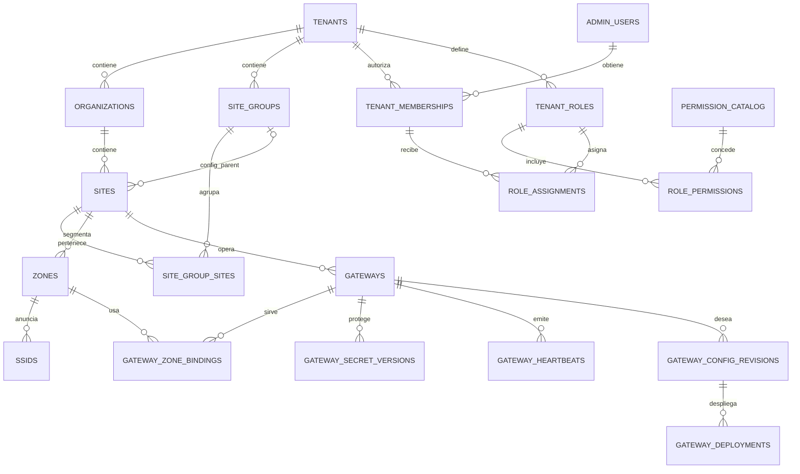
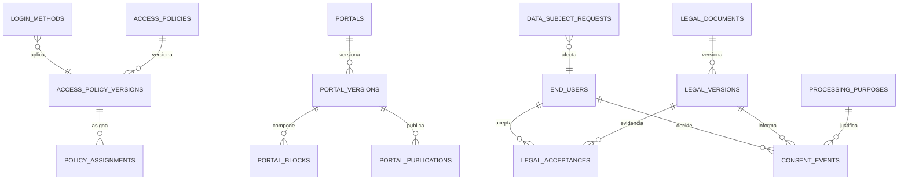
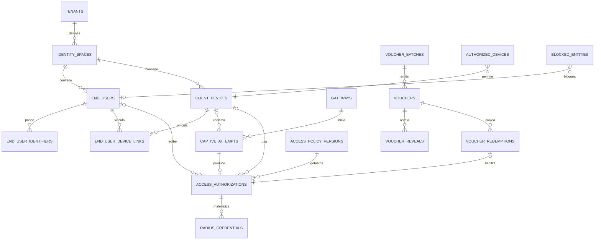
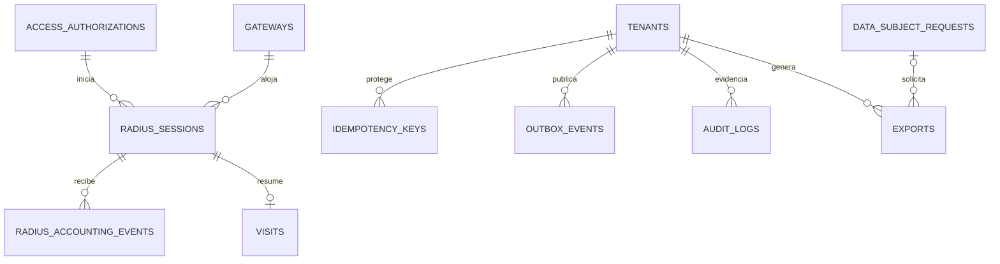

# WPass — ERD inicial del MVP

**Estado:** propuesto  
**Fecha:** 2026-08-15  
**Decisión pendiente:** respuestas 1, 3, 7, 8 y validación PAP/CHAP

El modelo cubre el núcleo vendible: tenancy/IAM, sedes/red, políticas, portal/legal, click/email/PIN, vouchers, dispositivos, AAA, accounting, sesiones, auditoría, privacidad y exportación. Campañas, PMS, pagos, TPV, formularios, email comercial y NMS completo se añaden después como módulos consumidores de IDs estables.

## Convenciones

- IDs públicos UUIDv7 o ULID; nunca secuenciales.
- `tenants`, `admin_users`, `permission_catalog` y `role_templates` son entidades de plataforma. Toda tabla de negocio restante lleva `tenant_id NOT NULL`.
- Cada tabla tenant tiene `UNIQUE (tenant_id, id)` para permitir FKs compuestas.
- Toda FK entre tablas tenant incluye `(tenant_id, fk_id)`.
- Timestamps como `timestamptz` UTC; la zona de sede solo interviene al calcular/presentar políticas.
- Estado legal, políticas, publicaciones y accounting son hechos versionados o append-only, no filas sobrescritas.
- PII recuperable se cifra; búsqueda/dedupe usa HMAC ciego con clave del `identity_space`, no un hash global.
- Los schemas propuestos son `app`, `radius_runtime` y `audit`; separar schemas no sustituye permisos ni RLS.

## Agregados

| Agregado | Raíz | Responsabilidad transaccional |
|---|---|---|
| Tenant/IAM | `tenants`, `tenant_memberships` | Frontera contractual, roles y alcances |
| Organización/sede | `organizations`, `sites` | Jerarquía, herencia, zona horaria y branding |
| Gateway | `gateways` | Inventario, identidad NAS, secretos, desired state y deployments |
| Política | `access_policies` | Versiones inmutables y asignación por alcance |
| Portal | `portals` | Versiones, bloques y publicación efectiva |
| Legal/privacidad | `legal_documents`, `processing_purposes` | Versiones, aceptación, consentimiento y DSR |
| Identidad/dispositivo | `identity_spaces`, `end_users`, `client_devices` | Consolidación permitida y vínculos temporales |
| Autorización | `access_authorizations` | Decisión exacta que habilita AAA |
| Voucher | `voucher_batches`, `vouchers` | Emisión, revelado, redención, revocación y usos |
| Sesión RADIUS | `radius_sessions` | Estado normalizado de red y consumo |
| Evidencia | `audit_logs`, `exports` | Trazabilidad, idempotencia y entrega controlada |

## Diagrama A — tenancy, IAM, sedes y red

### Tablas de tenancy/IAM

| Tabla | Campos/relaciones críticas | Garantías |
|---|---|---|
| `tenants` | `id`, `slug`, `name`, `status`, `data_region`, `default_timezone` | `slug` global único; la plataforma no es tenant |
| `admin_users` | identidad global, email cifrado/HMAC, estado | Sin acceso por existir; requiere membership/asignación |
| `tenant_memberships` | tenant, user, estado | único tenant/user; alta/baja auditada |
| `permission_catalog` | código atómico y descripción | catálogo global versionado |
| `role_templates` | roles iniciales ENTELSAT/cliente | plantilla, no concede acceso por sí sola |
| `tenant_roles` | tenant, nombre, origen template | roles personalizados sin permisos fuera del catálogo |
| `role_permissions` | tenant role + permission | deny-by-default |
| `role_assignments` | membership, role, uno de tenant/org/group/site, vigencia | `CHECK` XOR de alcance; no auto-escalation |
| `mfa_methods` | user, tipo, secreto cifrado/credential id | TOTP inicial; recovery codes HMAC |
| `admin_sessions` | user, auth level, issued/expires/revoked | reauth y step-up trazables |

### Tablas de sede/red

| Tabla | Campos/relaciones críticas | Garantías |
|---|---|---|
| `organizations` | tenant, código, razón social, estado | `(tenant_id, code)` único activo |
| `site_groups` | tenant, organization opcional, nombre, tipo | grupo padre de config o clasificación |
| `site_group_sites` | tenant, group, site | N:M sin duplicados |
| `sites` | tenant, organization, `config_parent_group_id`, código, zona horaria, país, idiomas, branding, DPO/contactos | una sola fuente padre; precedencia sede > grupo > org > tenant |
| `zones` | tenant, site, nombre, tipo | `(tenant, site, name)` único activo |
| `ssids` | tenant, zone, nombre lógico, MAC-private instructions | no intenta administrar radios ajenas |
| `gateways` | tenant, site, modelo, serial, RouterOS, arch, MAC, `nas_identifier`, estado, FQDN/origen login | `nas_identifier` global único; serial único por tenant si existe |
| `gateway_zone_bindings` | tenant, gateway, zone, bridge/VLAN/subred/pool/DNS/profile | no colisión por gateway; preflight de red |
| `gateway_secret_versions` | tenant, gateway, purpose, ciphertext, key version, created/retired | nunca secreto claro; rotación por propósito |
| `gateway_heartbeats` | tenant, gateway, observed_at, métricas acotadas | time-series/partición; sin secretos |
| `gateway_config_revisions` | tenant, gateway, desired snapshot hash, modo, versión, creator | inmutable; una revisión deseada activa |
| `gateway_deployments` | revision, preflight/diff/backup refs, state, lease, timestamps, evidence hash | state machine; idempotency key; rollback explícito |

## Diagrama B — políticas, portal y legal

| Tabla | Campos/relaciones críticas | Garantías |
|---|---|---|
| `access_policies` | tenant, nombre, status | identidad estable; contenido en versiones |
| `access_policy_versions` | tenant, policy, version, vigencias y snapshot de tiempo/rate/cuota/concurrencia/recurrencia | inmutable; números/unidades explícitos |
| `policy_assignments` | tenant, policy_version, exactamente un alcance tenant/org/group/site/zone, priority, validity | no solapamiento ambiguo; una default efectiva |
| `login_methods` | tenant, scope/site/portal, tipo, label/order, policy version, availability | tipos MVP limitados; configuración versionable |
| `portals` | tenant, nombre, tipo | raíz estable |
| `portal_versions` | tenant, portal, version, idioma fallback, theme snapshot, state | draft inmutable tras publish |
| `portal_blocks` | tenant, portal version, tipo, order, props validadas | sin HTML arbitrario en MVP |
| `portal_publications` | tenant, version, site/zone, starts/ends, snapshot/object hash | rangos no solapados por alcance; rollback por nueva publicación |
| `processing_purposes` | tenant, code, base jurídica, controller, retention class | finalidad explícita y aprobada |
| `legal_documents` | tenant, tipo, owner/scope | términos, privacidad, marketing separados |
| `legal_versions` | tenant, document, version, locale, content hash, published_at | inmutable y direccionable |
| `legal_acceptances` | tenant, user/device/authorization, legal version, locale, occurred_at, evidence | prestación/condiciones; append-only |
| `consent_events` | tenant, user, purpose, legal version, granted/rejected/withdrawn, occurred_at, evidence | decisión granular; append-only; retirada no borra historia |
| `data_subject_requests` | tenant, identity space, user, tipo, state, due_at, approvals, evidence refs | workflow; separación create/approve/execute |

La aceptación de condiciones no se modela como consentimiento de marketing. Que ambas puedan aparecer en la misma pantalla no las convierte en el mismo hecho jurídico.

## Diagrama C — identidad, captive, vouchers y AAA

| Tabla | Campos/relaciones críticas | Garantías |
|---|---|---|
| `identity_spaces` | tenant, controller/org boundary, key version, merge policy | impide correlación entre responsables |
| `end_users` | tenant, identity space, pseudonymous id, status, retention anchor | fila mínima; PII en identifiers |
| `end_user_identifiers` | tenant, identity space, user, type, ciphertext, value_hmac, verified_at | único por `(identity_space,type,hmac)` si dedupe habilitado |
| `client_devices` | tenant, identity space, encrypted normalized MAC, `mac_hmac`, first/last seen | MAC como identificador técnico, no identidad humana infalible |
| `end_user_device_links` | tenant, user, device, source, starts/ends, confidence | vínculo temporal y explicable |
| `captive_attempts` | tenant, gateway, state/nonce hash, claimed MAC/IP hash, return intent, expires/consumed | claims no confiables; state de un uso |
| `access_authorizations` | tenant, attempt, exact policy version, method, user/device/voucher refs, starts/expires, status, effective attributes, evidence hash | decisión central e inmutable tras emitir |
| `radius_credentials` | tenant, authorization, opaque username global, verifier kind/value, expires, max uses, used count | username no colisiona; PAP/CHAP definitivo pendiente de lab |
| `voucher_batches` | tenant, site, policy version, count, starts/expires, defaults, idempotency | cantidad/límites positivos |
| `vouchers` | tenant, batch, `code_hmac`, display hint, state, max uses/devices, expires | código claro no persistente ordinario |
| `voucher_reveals` | tenant, voucher, ciphertext, reveal_until, consumed/destroyed | ventana corta; después rotación, no recuperación |
| `voucher_redemptions` | tenant, voucher, attempt/device, redeemed_at, outcome, authorization | consumo atómico y auditado |
| `authorized_devices` | tenant, scope, device/MAC HMAC, policy version, starts/expires, reason, approver | caducidad obligatoria salvo excepción aprobada |
| `blocked_entities` | tenant, scope global/org/site, subject type + HMAC, starts/expires, reason/evidence | IP/MAC/email/user/fingerprint; no PII clara en índice |

### Proyección `radius_runtime`

FreeRADIUS no consulta PII ni agrega lógica de negocio. Una vista/tabla de proyección expone solo:

- `username`, verificador compatible aprobado y expiración;
- gateway/NAS permitido y contexto de dispositivo cuando se active ese binding;
- atributos efectivos ya compilados;
- `Class` opaco con ID de autorización/correlación;
- estado revocado/usos.

La escritura de autorización, credencial y proyección es atómica. El formato exacto del verificador queda `BLOCKED_BY_LAB_VALIDATION`: PAP admite verificadores no reversibles; CHAP exige contraseña conocida en claro por FreeRADIUS.

## Diagrama D — sesiones, accounting y evidencia

| Tabla | Campos/relaciones críticas | Garantías |
|---|---|---|
| `radius_sessions` | tenant, gateway, authorization, username, acct session id, Class, MAC/IP, started/last/stop, counters 64-bit, cause, state | una sesión activa por key; contadores no negativos |
| `radius_accounting_events` | tenant, gateway, session ref, status, NAS/event/received times, octets+gigawords normalizados, delay, cause, redacted payload, fingerprint | append-only; fingerprint único; partición mensual |
| `visits` | tenant, site, user/device, authorization, first/last, session count | derivada de sesiones; definición estable de visita |
| `idempotency_keys` | tenant, actor/client, operation, key, request hash, response/status, expires | misma key + distinto payload rechaza |
| `outbox_events` | tenant, aggregate, type/version, payload redacted, occurred/published, attempts | misma transacción; consumidores idempotentes |
| `audit_logs` | tenant, actor/service, action, resource, scope, before/after redactados, IP, correlation, occurred, integrity chain/hash | append-only; UPDATE/DELETE rechazado |
| `exports` | tenant, requester, reason, scope, PII flag, approvals, object key/hash, state, expires/downloaded | objeto cifrado; URL de un uso; TTL corto |

## Constraints e índices obligatorios

### Aislamiento y ámbito

1. `UNIQUE (tenant_id, id)` en cada tabla de negocio y FK compuesta en cada relación tenant.
2. `ENABLE` + `FORCE ROW LEVEL SECURITY`; roles de aplicación no son owner ni tienen `BYPASSRLS`.
3. Policies default-deny basadas en contexto transaccional. Jobs y service accounts fijan tenant explícito.
4. `CHECK` de exactamente un alcance en asignaciones RBAC, políticas, publicaciones y bloqueos.
5. La pertenencia partner/organización/grupo jamás concede permisos implícitos.

### Unicidad, tiempo e inmutabilidad

1. Índices parciales excluyen filas archivadas para código de organización/sede y nombres de zona/SSID.
2. `gateways.nas_identifier` global único; `(tenant_id, serial)` único cuando `serial IS NOT NULL`.
3. `CHECK (ends_at IS NULL OR ends_at > starts_at)` y contadores/límites no negativos.
4. Una política default activa por alcance mediante índice parcial.
5. Publicaciones portal/legal sin solapamiento por alcance mediante exclusion constraint sobre `tstzrange`.
6. Trigger o privilegios que impiden UPDATE/DELETE de versiones usadas, consent events, legal acceptances, accounting y audit.

### PII, MAC y vouchers

1. MAC normalizada a 12 hex minúsculas antes de cifrar/HMAC; `UNIQUE(identity_space_id, mac_hmac)` según política de dedupe.
2. Identificador único `(identity_space_id, type, value_hmac)` cuando la finalidad permite deduplicar.
3. Voucher único `(tenant_id, code_hmac)`; redención usa lock/compare-and-swap sobre usos/estado/expiración.
4. No hay índice global de email/teléfono/MAC. La rotación de blind-index conserva una ventana dual controlada.

### RADIUS y accounting

1. Índice de auth por `radius_credentials.username` global único, expiración y status.
2. Índice de sesión `(tenant_id, gateway_id, acct_session_id, started_at)` y único parcial de sesión activa por gateway/session id.
3. `UNIQUE (tenant_id, event_fingerprint)` en accounting.
4. Fingerprint canónico incluye gateway/NAS, acct-session-id, status, tiempo de evento/sesión y contadores de 64 bits; no solo tipo.
5. Índice `(tenant_id, radius_session_id, event_at)`; partición mensual y BRIN por `received_at` tras validar volumen.
6. `received_at` de plataforma nunca reemplaza el timestamp/uptime declarado por NAS.

### Operación, auditoría y exportación

1. Heartbeats: `(tenant_id, site_id, status, observed_at DESC)` o partición time-series equivalente.
2. Vouchers: `(tenant_id, site_id, state, expires_at)` y `(tenant_id, batch_id)`.
3. Consentimiento: `(tenant_id, end_user_id, purpose_id, occurred_at DESC)`.
4. Auditoría: `(tenant_id, occurred_at DESC)`, actor y recurso; payload redactado por esquema, no por buena voluntad del caller.
5. Object keys comienzan con entorno/tenant/clase y la DB guarda hash, cifrado, TTL y finalidad.

## Ciclos de vida

| Entidad | Mutación permitida | Eliminación |
|---|---|---|
| Política/portal/legal draft | editar hasta publicar | archivar si nunca se usó |
| Versión publicada/usada | ninguna; crear nueva versión | `RESTRICT`, sujeta a retención |
| Consent/acceptance/audit/accounting | append-only | workflow de retención, no CRUD ordinario |
| End user/identifier | rectificar mediante evento/cambio controlado | DSR anonimiza/elimina según base jurídica |
| Voucher | transiciones de state y contadores atómicos | archivar; no borrar redenciones/evidencia |
| Sesión | proyección avanza monotónicamente | retención/anonimización programada |
| Export | state machine y descarga | objeto expira; metadata/evidencia según retención |

Restaurar un backup debe reaplicar tombstones de DSR posteriores al punto restaurado para no reintroducir PII borrada.

## Módulos expresamente diferidos

- `campaigns`, `creatives`, `rule_sets`, `rule_executions`;
- `forms`, `questions`, `form_responses`;
- `email_templates`, `email_deliveries`, suppression;
- `integrations`, `integration_secrets`, `webhook_deliveries`, `pms_stays_cache`;
- `subscriptions`, `usage_counters`, pagos y facturas;
- `network_devices`, dependencias, NMS, alertas avanzadas.

Se añadirán con migraciones propias. No se crean tablas vacías ni TODOs para simular alcance entregado.

## Puntos a cerrar antes de migraciones

- frontera `tenant`/`identity_space` y responsable real;
- regla de herencia y grupo padre;
- modelos físicos, PAP/CHAP y campos necesarios para binding RADIUS;
- retención por clase y reglas de anonimización;
- capacidad objetivo para particiones e índices;
- SLA/topología que determine HA de PostgreSQL/RADIUS.

Fuentes: [PostgreSQL RLS](https://www.postgresql.org/docs/18/ddl-rowsecurity.html), [MikroTik RADIUS](https://manual.mikrotik.com/docs/authentication-authorization-accounting/radius/), [FreeRADIUS authentication protocols](https://www.freeradius.org/documentation/freeradius-server/3.2.9/concepts/protocol/authproto.html), [RGPD oficial](https://eur-lex.europa.eu/legal-content/ES/TXT/?uri=CELEX:32016R0679).
