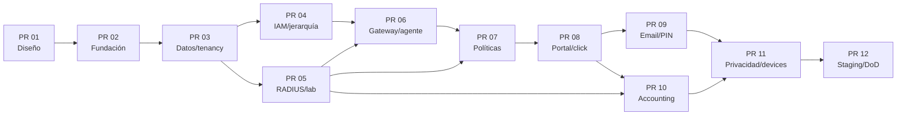

# WiFi ENTELSAT — plan de entrega en 12 PRs

**Estado:** propuesto; no ejecutar hasta aprobar la puerta de decisiones  
**Objetivo:** MVP demostrable y desplegable sin convertir cada PR en una rama de meses

## Reglas de entrega

Cada PR incluye:

- objetivo, alcance explícito y exclusiones;
- ADR/C4/ERD/OpenAPI actualizados cuando cambie un contrato;
- migración forward, estrategia de rollback/roll-forward y datos seed sin PII;
- unit, integration, contract y e2e proporcionales al riesgo;
- threat cases y checklist de seguridad;
- health/readiness, logs JSON y métricas nuevas;
- prueba manual reproducible y evidencia;
- archivos cambiados, comandos ejecutados, riesgos abiertos y siguiente PR.

No se mergea con tests rojos, migración no reproducible, hallazgo crítico/alto no aceptado o función RouterOS presentada como soportada sin laboratorio. Lo bloqueado se marca `BLOCKED_BY_LAB_VALIDATION`; no se resuelve con mocks.

## Resumen y dependencias

| PR | Título | Depende de | Gate principal |
|---:|---|---|---|
| 01 | Contratos y diseño aceptado | Decisiones 1–10 | Aprobación humana, sin código de producto |
| 02 | Monorepo, CI y runtime reproducible | 01 | Build/test/scans e imágenes por SHA |
| 03 | PostgreSQL, tenancy, RLS, audit y outbox | 02 | Cero fuga multi-tenant |
| 04 | Auth admin, RBAC y jerarquía operativa | 03 | TOTP, scopes y auditoría |
| 05 | FreeRADIUS, SQL, NAS simulator y spike RouterOS | 02–03 | CHR + físico; decisión PAP/CHAP/atributos |
| 06 | Gateways, bootstrap y agente declarativo | 04–05 | mTLS, preflight, diff y rollback |
| 07 | Políticas y compilador RADIUS | 03, 05, 06 | Rate/time/idle/concurrencia/cuota probados |
| 08 | Portal ES/EN, legal y click-through | 04, 07 | Login real iOS/Android/Windows |
| 09 | Email, PIN y vouchers | 07–08 | Entropía, idempotencia, revocación e impresión |
| 10 | Accounting, sesiones, consumo y Disconnect/CoA | 05, 07–08 | Retransmisión, Stop perdido y fallback |
| 11 | Autorizados/bloqueados, DSR, retención y export | 04, 06–10 | Caducidad MAC y exportación auditada |
| 12 | Staging, continuidad, restore y aceptación física | Todos | Definition of Done completa |

Ruta crítica: `01 → 02 → 03 → 04 → 06 → 07 → 08 → 09/10 → 11 → 12`. El PR 05 comienza después del 03 y puede avanzar en paralelo con el 04.

## PR 01 — contratos y diseño aceptado

**Objetivo:** convertir estos artefactos propuestos en baseline aprobado.

**Incluye:**

- decisiones bloqueantes respondidas;
- ADRs aceptados/rechazados con owner;
- C4, ERD, matriz RBAC y STRIDE revisados;
- OpenAPI inicial de admin/captive/agent con errores e idempotencia;
- modelo de disponibilidad/RTO/RPO y tabla de retención aprobable;
- plan de laboratorio con hardware reservado.

**Excluye:** scaffolding y código de producto.

**Aceptación:** ninguna contradicción entre API, ERD, permisos y flujos; DPO firma supuestos jurídicos; responsable de red acepta qué queda bloqueado por lab.

**Rollback:** revertir el documento/ADR concreto; no hay datos ni runtime.

## PR 02 — monorepo, CI y runtime reproducible

**Objetivo:** crear una base que falle pronto y produzca artefactos repetibles.

**Incluye:** pnpm + Turborepo, TypeScript strict, apps/packages vacíos con límites, lint/format/typecheck, tests, OpenAPI generation, cliente tipado, Docker multi-stage non-root, compose dev, health/readiness, correlation ID, OTel traces/metrics y logs JSON.

**Version freeze:** ejecutar spike y fijar Node LTS, Next LTS parcheado, Nest/Fastify compatible, Prisma 7, PostgreSQL, Redis/BullMQ y FreeRADIUS 3.2.x. Documentar fuente, fecha, digest y matriz de compatibilidad.

**CI:** lint, types, unit, build, image build, SBOM, dependency/secret/SAST scan y verificación de lockfile.

**Aceptación:** clon limpio → un comando instala, levanta dependencias, ejecuta tests y construye imágenes; imágenes arrancan sin root y responden healthcheck.

**Rollback:** imágenes/lockfile anteriores por SHA; no hay migraciones de negocio.

## PR 03 — datos, tenancy, RLS, auditoría y outbox

**Objetivo:** establecer la frontera de seguridad antes de añadir recursos.

**Incluye:** schemas/roles DB, tenant, identity space, IAM mínimo de servicio, Prisma + migraciones SQL, FKs compuestas, `FORCE RLS`, transaction tenant context, audit append-only, idempotency keys y transactional outbox.

**Tests clave:**

- API y SQL directo intentan leer/mutar/enlazar otro tenant;
- worker procesa job con tenant incorrecto o ausente;
- migrator/owner separado del runtime;
- replay de idempotency key concurrente;
- caída tras commit antes de publicar outbox;
- intento de UPDATE/DELETE de audit.

**Aceptación:** todos los tests negativos fallan cerrados; migración desde cero y N-1 reproducible; ningún rol runtime tiene `BYPASSRLS`.

**Rollback:** expand-contract; restore solo en entorno desechable. En staging/producción se corrige hacia delante salvo runbook aprobado.

## PR 04 — auth admin, RBAC y jerarquía operativa

**Objetivo:** permitir administrar el alcance básico con trazabilidad.

**Incluye:** login admin, TOTP/recovery, sesiones/reauth, permission catalog, roles/asignaciones y scopes; tenants, organizaciones, grupo padre, sedes, zonas y SSID; shell admin con selector persistente; auditoría de cambios.

**Tests clave:** matriz RBAC positiva/negativa, auto-escalation de admin sede, revocación con sesión activa, step-up 2FA y paginación/filter injection tenant.

**Aceptación:** crear tenant → organización → grupo/sede → zona/SSID sin fuga; soporte ve enmascarado y no muta; superadmin usa JIT para PII, no bypass invisible.

**Rollback:** desactivar rutas/feature flags; migraciones aditivas.

## PR 05 — FreeRADIUS, SQL, NAS simulator y spike RouterOS

**Objetivo:** cerrar las incógnitas del plano de acceso antes de construir UX encima.

**Incluye:** FreeRADIUS 3.2.10 versionado, diccionario MikroTik oficial, schema/proyección `radius_runtime`, rol SQL mínimo, clientes NAS de laboratorio, simulador con `radclient`/Testcontainers, post-auth/accounting inbox y pruebas CHR + RouterBOARD.

**Decisiones que debe cerrar:**

- HTTPS/PAP vs CHAP y formato de verificador;
- `Message-Authenticator` y secretos por gateway;
- `Port-Limit` + `Simultaneous-Use` server-side;
- rate, session, idle, interims, cuotas/Gigawords;
- orientación Input/Output;
- Disconnect/CoA, selector exacto y puerto 1700/3799;
- transporte WireGuard/UDP y failover.

**Aceptación:** L02–L17 completadas con evidencia en CHR y al menos un equipo físico; atributos no validados no pasan a supported.

**Rollback:** configuración de lab restaurada desde export/backup; ningún cambio en router de producción.

## PR 06 — gateways, bootstrap y agente declarativo

**Objetivo:** inventariar y operar un gateway sin abrir gestión pública.

**Incluye:** gateway/zone binding, secrets versionados, bootstrap hash de un uso y TTL, identidad mTLS, heartbeat, inventario read-only, desired revisions, leases, comandos firmados/idempotentes, preflight/diff/backup/apply/health/rollback y tres modos de aprovisionamiento.

**Secuencia de riesgo:** comenzar con simulador/read-only; habilitar apply solo tras review del diff y equipo físico aislado.

**Tests clave:** token expirado/replay, agente de otro tenant, comando alterado, pérdida de conexión en cada estado, usuario RouterOS mínimo, actualización firmada/anti-rollback.

**Aceptación:** alta y rotación sin revelar secretos; ninguna interfaz WinBox/SSH/REST pública; rollback recupera gestión o marca intervención manual con evidencia.

**Rollback:** retirar/revocar identidad del agente y volver a revisión anterior; backup explícito.

## PR 07 — políticas y compilador RADIUS

**Objetivo:** transformar una política versionada en atributos probados y explicables.

**Incluye:** policies/versions/assignments, herencia, validación de contradicciones, effective preview, login methods y compilador a proyección RADIUS. Guardar snapshot/atributos en autorización.

**Reglas:**

- `Mikrotik-Rate-Limit`, `Session-Timeout`, `Idle-Timeout`, `Acct-Interim-Interval` y `Port-Limit` según evidencia;
- `Simultaneous-Use` es control FreeRADIUS, no reply RouterOS;
- cuota total/burst/CoA solo si PR05 los aprobó por modelo/versión;
- UI explica rx/upload y tx/download sin ambigüedad.

**Aceptación:** matriz de combinaciones válida/inválida; preview muestra origen tenant/org/grupo/sede; resultados físicos dentro de tolerancia.

**Rollback:** publicar nueva versión; nunca editar una versión usada.

## PR 08 — portal ES/EN, legal y click-through

**Objetivo:** completar el primer acceso real de extremo a extremo.

**Incluye:** portal mobile-first, bloques permitidos, branding, draft/publish/rollback, snapshots/assets, ES/EN/fallback, WCAG 2.2 AA; términos y privacidad versionados; aceptación separada de marketing; captive attempt state/nonce/TTL; login click-through y retorno seguro al servlet.

**Seguridad:** parámetros RouterOS no confiables; origen reconstruido; `link-orig`/post-login allowlist; CSP; same-origin preauth; sin CDN/fuentes/HTML arbitrario; credenciales fuera de URL/logs.

**Aceptación:** L02–L09 y login real iOS/Android/Windows; rechazo de marketing no impide WiFi; versión legal exacta queda ligada.

**Rollback:** volver a publicación anterior; captive API backward-compatible.

## PR 09 — email, PIN y vouchers

**Objetivo:** añadir los métodos comerciales básicos sin debilitar el portal.

**Incluye:** captura de email; verificación OTP solo si la decisión 4 y CNA la aprueban; PIN/voucher individual/lotes; generación criptográfica, HMAC, reveal TTL, estados, redención atómica, revoke/extend/reprint por rotación, PDF/CSV y API idempotente interna.

**Seguridad:** respuestas indistinguibles, rate limit por IP/sede/código/dispositivo, alta entropía, comparación constante, sin webmail abierto en walled garden.

**Aceptación:** concurrencia de redención no supera usos; revoke impide nuevo login; reprint posterior al TTL rota; PDF/CSV respeta permisos y no queda público.

**Rollback:** desactivar método por sede; revocar lote; no recuperar secretos destruidos.

## PR 10 — accounting, sesiones, consumo y desconexión

**Objetivo:** convertir paquetes AAA en sesiones fiables y operación observable.

**Incluye:** inbox append-only/fingerprint, normalizador Start/Interim/Stop, contadores 64-bit, reconciliación Stop perdido/reboot, sesión/visita, dashboard operativo inicial, top consumo, Disconnect/CoA exacto y fallback agente.

**Tests clave:** retransmisión exacta, varios Interim legítimos, out-of-order, Stop antes de Start, pérdida de Response, restart worker, contador rollover, desconexión vecina y CoA no soportado.

**Aceptación:** L10–L19; ningún duplicate lógico; dashboard distingue persona/dispositivo/sesión/visita; fallback queda etiquetado, no simula ACK.

**Rollback:** replay del inbox para reconstruir proyección; feature flag para CoA/fallback por modelo.

## PR 11 — autorizados/bloqueados, privacidad, retención y export

**Objetivo:** completar operación de dispositivos y obligaciones de datos.

**Incluye:** authorized/blocked con scope/TTL/reason; MAC privada e instrucciones; expiry; DSR state machine; tabla de retención aprobada; cifrado/HMAC por identity space; export PII con doble aprobación/reauth; objeto cifrado, hash, URL de un uso y TTL; borrado/anonimización y tombstones de restore.

**Tests clave:** MAC expirada/reasociada, scope global indebido, export cruzado, auto-aprobación, descarga repetida, retención por clase, restore que intenta reintroducir PII borrada.

**Aceptación:** authorized MAC expira y vuelve al portal; DSR/export queda auditado; soporte/marketing/recepción no exceden matriz.

**Rollback:** desactivar jobs destructivos; dry-run obligatorio antes de primera retención; restauración mediante runbook.

## PR 12 — staging, continuidad y Definition of Done

**Objetivo:** demostrar que el conjunto es operable y recuperable, no solo que “compila”.

**Incluye:** despliegue Coolify por SHA, healthchecks, secretos/env documentados, dos FreeRADIUS y topología privada, PostgreSQL HA/PITR según SLA, backups S3 cifrados, restore, observabilidad/alertas, load/resilience, DAST/pentest readiness, runbooks y e2e físico completo.

**Pruebas de aceptación:**

- aislamiento multi-tenant y RBAC completo;
- iOS/Android/Windows + MikroTik físico;
- rate/time/idle/quota/concurrencia;
- Start/Interim/Stop, revoke, expiry MAC y disconnect;
- caídas API/Redis/PostgreSQL/RADIUS/túnel/agente/WAN;
- failover RADIUS y WAN `main`;
- PITR/restore y tombstones DSR;
- escaneo sin críticos/altos no aceptados;
- sin puertos de gestión públicos.

**Aceptación:** todos los criterios originales del MVP tienen evidencia enlazada. Un mock o CHR aislado no reemplaza RouterBOARD/CNA real.

**Rollback:** imágenes previas por SHA, migraciones expand-contract, restore ensayado y runbook con owner/RTO.

## Métricas de salida por PR

| Área | Métrica mínima |
|---|---|
| Calidad | tests ejecutados/fallidos, coverage útil y contract drift |
| Seguridad | findings por severidad y excepciones con caducidad |
| Datos | duración de migración, locks, rollback/roll-forward probado |
| Portal | p50/p95/p99, peso inicial, conversión por paso y errores |
| RADIUS | accepts/rejects/timeouts/bad-replies, RTT y accounting backlog |
| Agente | heartbeats, command latency, failed deploys y rollbacks |
| Continuidad | RTO/RPO observado, pérdida/duplicación de eventos |

## Cambios de alcance

Una petición de PMS, pagos, TPV, campañas, drag-and-drop, NMS o SSO antes del PR 12 se registra como cambio de alcance. Debe indicar qué PR se divide o retrasa y qué nueva amenaza, dato, proveedor y criterio de aceptación introduce.
