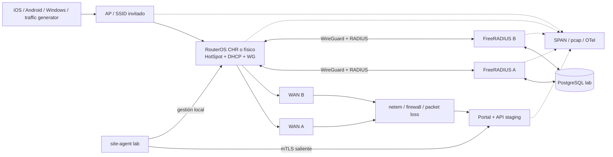

# WPass — plan de laboratorio MikroTik

**Estado:** propuesto  
**Objetivo:** convertir supuestos RouterOS/RADIUS/CNA en una matriz de soporte reproducible  
**Regla de seguridad:** solo CHR y RouterBOARD expresamente dedicados al laboratorio. Ningún comando se aplica a routers de cliente o producción.

## Salidas obligatorias

El laboratorio debe decidir, con evidencia:

1. modelos y línea RouterOS soportados;
2. HTTPS/PAP frente a CHAP y formato de credencial FreeRADIUS;
3. atributos exactos para rate, tiempo, idle, interims, concurrencia y cuotas;
4. orientación de contadores y deduplicación de accounting;
5. selector, puerto y comportamiento Disconnect/CoA/fallback;
6. CNA/CAPPORT real en Apple, Android y Windows;
7. failover RADIUS/WAN y comportamiento de sesiones existentes/nuevas;
8. preflight, diff, backup, apply y rollback del agente;
9. límites IPv4, walled garden y multi-WAN/PCC que mostrará la UI.

Hasta completar estas salidas permanecen `BLOCKED_BY_LAB_VALIDATION` los ADR-006, 007, partes del 008 y la matriz de soporte del producto.

## Baseline de versiones al 2026-08-15

| Componente | Versión/canal | Uso |
|---|---:|---|
| RouterOS | 7.21.5 long-term | candidato conservador de producción |
| RouterOS | 7.23.2 stable | candidato stable y comparación de regresión |
| FreeRADIUS | 3.2.10 | única rama de servidor para MVP |
| CHR | mismas dos versiones | automatización y regresión rápida |
| RouterBOARD físico 1 | modelo real del piloto | aceptación comercial |
| RouterBOARD físico 2 | modelo mínimo soportado | límite inferior de CPU/RAM/storage |

Candidatos si aún no existe piloto: RB5009UG+S+IN como gateway y hAP ax³ como equipo integrado ARM64. CCR2004 se incorpora si representa el dimensionamiento real. La selección final es una respuesta bloqueante, no una preferencia del documento.

Cada ejecución registra versión exacta, canal, paquetes instalados, firmware RouterBOOT, arquitectura, modelo y hash de configuración. Nunca se concluye “RouterOS 7 soportado” a partir de una sola versión.

## Banco de pruebas

### Hardware y clientes

- 1 host de virtualización con CHR y snapshots.
- 2 RouterBOARD físicos según la decisión 5.
- 1 switch gestionable con VLAN y puerto espejo.
- 1 AP del ecosistema real del piloto; opcional segundo fabricante para confirmar neutralidad radio.
- 2 uplinks de laboratorio o emulador WAN con latencia/pérdida/corte controlados.
- iPhone/iPad físico, dos Android de fabricantes distintos y Windows 11 físico.
- equipo Linux para `iperf3`, captura, DNS y emulación de fallos.
- consola/serial o acceso local de recuperación a cada RouterBOARD.

### Servicios

- API/portal de staging no productivo con certificado válido.
- dos FreeRADIUS 3.2.10 en nodos/dominios de fallo distintos.
- PostgreSQL de lab con roles `app`, `radius_runtime` y `audit`.
- WireGuard entre sede simulada y RADIUS.
- DNS controlado para hotspot/portal y NTP fiable.
- captura central de logs/metrics con redacción.

### Topología

La red invitada no alcanza la red de gestión. WinBox/SSH/REST no se publican en WAN. El puerto espejo/captura se protege porque un pcap puede contener identificadores y material de autenticación.

## Preparación segura

1. Etiquetar físicamente todos los equipos como laboratorio.
2. Guardar export/backup inicial y verificar recuperación por consola.
3. Usar secretos únicos de lab; nunca copiar secretos de producción.
4. Configurar DNS, hora y certificados antes de probar CNA.
5. Deshabilitar o aislar IPv6 en invitados hasta probar una política que impida bypass; HotSpot actual es fiable solo con IPv4.
6. Crear usuarios RouterOS separados read/apply y revisar policies exactas.
7. Activar logs de debug solo durante ventana breve; desactivarlos al terminar.
8. Automatizar reset a snapshot/estado conocido entre casos.
9. Sanitizar exports, pcaps, screenshots y logs antes de adjuntarlos.

## Matriz funcional y de protocolo

| ID | Caso | Método | Criterio de aprobación |
|---:|---|---|---|
| L01 | Preflight, `device-mode`, IPv4/IPv6 | CHR + físico; intentar bypass IPv6 | HotSpot habilitado; ningún tráfico invitado evita autenticación; colisiones se detectan antes de apply |
| L02 | Redirect externo | Capturar POST router → portal y retorno | Campos necesarios presentes; éxito/reject; ninguna credencial en URL/referer/log |
| L03 | Manipulación/replay | Alterar gateway, MAC, IP, `link-login`, `link-orig`, state y nonce | Rechazo seguro; origen de retorno se reconstruye; nonce no se reutiliza |
| L04 | HTTPS/PAP vs CHAP | Ejecutar ambos flujos con credencial efímera | Elegir uno reproducible; TLS válido; documentar formato at-rest; no aprobar CHAP sin aceptar cleartext-equivalent |
| L05 | Walled garden mínimo | Enumerar portal/API/assets y probar destinos no declarados | Funciona el mismo origen; dominios/path/protocolos ajenos quedan bloqueados; sin comodines amplios |
| L06 | CAPPORT | Captura DHCP y `api.json` antes/después | Option 114 presente cuando proceda; API HTTPS cambia `captive=true` a `false` |
| L07 | CNA real | iPhone/iPad, 2 Android y Windows 11 | Portal abre, completa flujo y se cierra correctamente; fallback a navegador normal documentado |
| L08 | Access-Request | Inspeccionar paquete y colisión local de username | NAS, MAC, HotSpot, interfaz, IP y session id coinciden; precedencia de usuario local demostrada y prevenida |
| L09 | Message-Authenticator | Defaults RouterOS y FreeRADIUS; secreto incorrecto | Compatibilidad confirmada; cero `bad-replies` en caso válido; fallo visible en caso inválido |
| L10 | Rate/burst/dirección | `iperf3` subida y descarga asimétricas | `1M/5M` se interpreta como ~1 Mbps upload/~5 Mbps download dentro de tolerancia; burst solo si se aprueba |
| L11 | Sesión/idle/concurrencia | Cronómetro + dos clientes/mismo usuario | timeouts dentro de tolerancia; `Port-Limit=1` bloquea segundo acceso; `Simultaneous-Use` server-side no se envía como reply |
| L12 | Cuotas y Gigawords | RX, TX, total y transferencia >4 GiB | Corte y accounting correctos; atributos exactos registrados por versión/modelo |
| L13 | Accounting normal | Start, varios Interim y Stop | un Start, N interims al intervalo y Stop con causa; `Class` intacto |
| L14 | Orientación/idempotencia | tráfico asimétrico + pérdida de Accounting-Response | Input/Output queda fijado empíricamente; retransmisión no duplica, interims legítimos no se descartan |
| L15 | Stop perdido/reboot | bloquear Stop, reiniciar y reconectar | siguiente Start/reconciliación cierra huérfana sin doble activa ni consumo inventado |
| L16 | Disconnect/fallback | DM exacto, luego fallback agente | ACK elimina solo objetivo, limpia cookie según decisión y emite Stop; fallback produce resultado equivalente y etiquetado |
| L17 | CoA | cambiar rate/timeouts; intentar IP/pool/routes | cambios soportados se aplican; IP/pool/routes no; sesiones vecinas intactas; ACK/NAK almacenado |
| L18 | Fallo nube/RADIUS | ejecutar matriz F01–F10 | existentes cumplen política; nuevos logins siguen decisión fail-closed/emergencia; recuperación sin duplicados |
| L19 | Redundancia RADIUS | cortar A y restaurar; luego B | auth/accounting conmutan dentro del RTO; sin sesión huérfana ni pérdida no explicada |
| L20 | Doble WAN failover | cortar WAN A/B con routing en `main` | portal/túnel/RADIUS recuperan dentro del RTO; sesiones se comportan como documentado |
| L21 | PCC negativo/local routing | reproducir mangle/múltiples tablas y mitigación local | limitación demostrada; regla local no se vende como soporte PCC general; UI lo bloquea |
| L22 | MAC privada y métodos externos | reasociar/cambiar MAC; probar UX sin social | expiración/revocación coherente; instrucciones por SSID; MVP no depende de OAuth embebido |

### Tolerancias a fijar antes de ejecutar

- rate: porcentaje aceptable y ventana de medida;
- timeouts: desviación máxima;
- accounting interim: intervalo y jitter;
- RADIUS RTT p95/p99;
- RTO de failover A→B y WAN A→B;
- pérdida/duplicación aceptable: para eventos lógicos debe ser cero;
- carga: 2× pico del piloto. Si la pregunta 2 sigue vacía, la prueba de rendimiento no puede aprobarse, solo generar una curva.

## Matriz de fallos

| ID | Inyección | Sesión existente esperada | Nuevo login esperado | Evidencia |
|---:|---|---|---|---|
| F01 | `admin-web` caído | continúa | continúa | health + login real |
| F02 | Redis/BullMQ caído | continúa | click/email/PIN básico continúa | queue backlog y ausencia de dependencia captive |
| F03 | portal caído | continúa | falla con contingencia | CNA/error y alerta |
| F04 | API captive caído | continúa | falla cerrado | HTTP, métricas y no bypass |
| F05 | PostgreSQL primario caído | continúa según RouterOS | según HA; cerrado si DB no disponible | failover/RTO y consistencia |
| F06 | FreeRADIUS A caído | continúa | conmuta a B | paquetes, RTT y accounting |
| F07 | ambos FreeRADIUS caídos | continúa según policy | cerrado o emergencia preemitida aprobada | no fail-open global |
| F08 | WireGuard/RADIUS route caído | continúa | falla/controla failover | ruta, timeout y recuperación |
| F09 | site-agent caído | AAA continúa | continúa si RADIUS funciona | deploy bloqueado, heartbeat |
| F10 | WAN A/ambas WAN caídas | depende de conectividad | no se promete Internet | failover y reconciliación |
| F11 | worker reiniciado con backlog | continúa | continúa | replay idempotente |
| F12 | clock skew gateway/API | no desconexión incorrecta | state/TTL falla seguro dentro de tolerancia | NTP alert y timestamps |

## Seguridad ofensiva mínima

- enumeración y brute force de PIN/voucher con respuestas indistinguibles;
- replay concurrente de voucher/state/credencial;
- open redirect y manipulación de host/puerto;
- XSS en branding/textos y MIME/upload falso;
- SSRF a IPs privadas/metadata mediante assets/URLs;
- NAS/gateway equivocado reutilizando credencial;
- paquete RADIUS con secreto/Message-Authenticator incorrecto;
- Disconnect/CoA dirigido a sesión vecina;
- comando agente alterado, repetido, expirado o de otro gateway;
- acceso invitado a WinBox/SSH/REST/SNMP/management;
- log scan buscando email claro, voucher, token, password y shared secret.

## Evidencia por ejecución

Cada run produce un manifiesto con:

- `run_id`, fecha UTC, operador y revisor;
- test ID, precondiciones y resultado esperado/real;
- modelo, arquitectura, serial redactado, RouterOS/RouterBOOT/paquetes;
- FreeRADIUS/app commit SHA e image digest;
- hash de config/export sanitizado antes/después;
- pcap sanitizado, logs RADIUS/HotSpot, métricas y screenshots CNA;
- mediciones y tolerancia;
- incidencias, workaround y decisión de soporte;
- SHA-256 de cada artefacto.

No adjuntar secretos, contraseñas, tokens, códigos voucher, PII real ni pcaps sin sanitizar. Los datos de cliente se sustituyen por seeds sintéticos.

## Gates de salida

### Gate A — simulación

NAS simulator y CHR completan L01–L17; tests repetibles en CI/lab. No aprueba hardware.

### Gate B — RouterBOARD

L02–L21 pasan en el modelo real del piloto y el modelo mínimo, en la línea RouterOS candidata. Toda diferencia se incorpora a una support matrix por modelo/versión.

### Gate C — clientes reales

L06–L07 y L22 pasan en iOS/iPadOS, dos Android y Windows 11 con builds registradas.

### Gate D — continuidad y seguridad

L18–L20, F01–F12 y seguridad ofensiva cumplen SLA/tolerancias; restore de configuración probado.

### Gate E — aprobación

Arquitectura, red, QA y seguridad firman la evidencia. Solo entonces:

- ADR-007 elige PAP/CHAP;
- ADR-008 convierte atributos en `supported` por modelo/versión;
- Disconnect/CoA y cuotas se habilitan en UI;
- la línea RouterOS pasa a matriz de producción.

## Fuentes primarias

- [MikroTik: HotSpot y limitaciones IPv4/PCC](https://manual.mikrotik.com/docs/authentication-authorization-accounting/hotspot-captive-portal/)
- [MikroTik: autenticación externa](https://manual.mikrotik.com/docs/authentication-authorization-accounting/hotspot-captive-portal/hotspot-customisation/)
- [MikroTik: RADIUS, atributos, accounting y CoA](https://manual.mikrotik.com/docs/authentication-authorization-accounting/radius/)
- [MikroTik: diccionario vendor](https://manual.mikrotik.com/assets/319783011_MikroTik_Vendor_attributes.txt)
- [MikroTik: changelogs](https://mikrotik.com/download/changelogs?channelFilter=stable)
- [FreeRADIUS 3.2.10 announcement](https://lists.freeradius.org/hyperkitty/list/freeradius-announce%40lists.freeradius.org/2026/6/)
- [FreeRADIUS radclient](https://www.freeradius.org/radiusd/man/radclient.html)
- [Apple CAPPORT](https://developer.apple.com/news/?id=q78sq5rv)
- [Android captive portals](https://source.android.com/docs/core/connect/android-custom-tabs-captive-portal)
- [Windows captive portals](https://learn.microsoft.com/en-us/windows-hardware/drivers/mobilebroadband/captive-portals)
